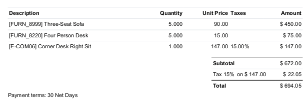
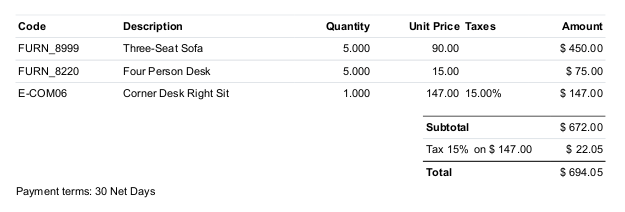

In odoo, user has the possibility to rename the "description" field of an invoice line, and at the same time delete / alter the product code.
But in some situation, removing the product code is a problem, because it should be present on the invoice report.

This module avoids this problem.

For that purpose, this module adds a new dedicated column "Default code"
in the account invoice report.
As a side effect, it improves readability of the invoices.

**Without this module**

**With this module**

