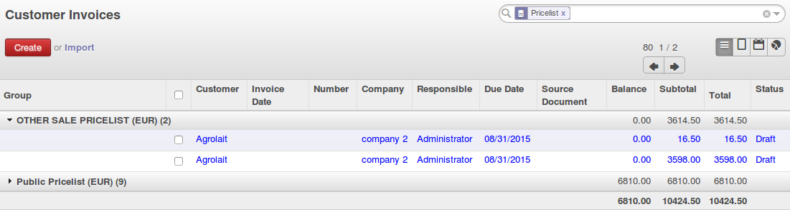

.. image:: https://img.shields.io/badge/licence-AGPL--3-blue.svg
   :target: http://www.gnu.org/licenses/agpl-3.0-standalone.html
   :alt: License: AGPL-3

=====================
Pricelist on Invoices
=====================

* Add a stored field pricelist on invoices, related to the partner pricelist;
* Possibility to group by pricelist on account.invoice view;

Bug Tracker
===========

Bugs are tracked on `GitHub Issues <https://github.com/OCA/account-invoicing/issues>`_.
In case of trouble, please check there if your issue has already been reported.
If you spotted it first, help us smashing it by providing a detailed and welcomed feedback.

Credits
=======

Contributors
------------

* Sylvain LE GAL (https://twitter.com/legalsylvain)
* Holger Brunn (hbrunn@therp.nl)
* Sergio Teruel Albert (http://www.tecnativa.com)
* Ronald Portier, Therp BV (https://therp.nl)

Maintainer
----------

.. image:: https://odoo-community.org/logo.png
   :alt: Odoo Community Association
   :target: https://odoo-community.org

This module is maintained by the OCA.

OCA, or the Odoo Community Association, is a nonprofit organization whose
mission is to support the collaborative development of Odoo features and
promote its widespread use.

To contribute to this module, please visit https://odoo-community.org.
