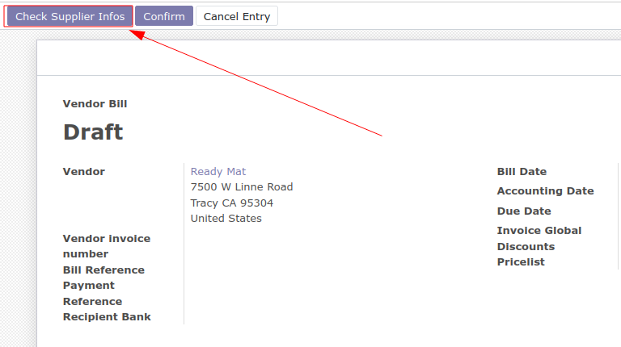
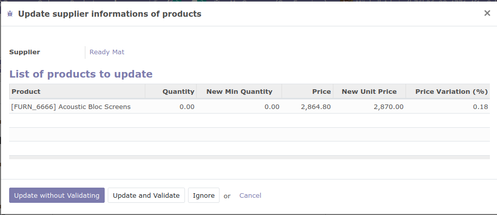
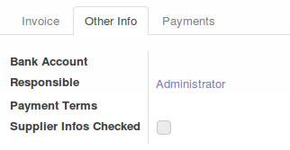

This module adds a new button 'Check Supplier Info' in supplier
invoice form.

When the user clicks on it, he can see the supplier information changes that will apply. Optionally, he can remove some temporary changes, specially, if,
for example, a supplier applied an exceptional price change.

* blue: Creates a full new supplier info line
* brown: Updates current settings, displaying price variation (%)

This module adds an extra boolean field 'Supplier Informations Checked' in the
'Other Info' tab inside the supplier invoice form. 
This field indicates that the prices have been checked and
supplierinfo updated (or eventually that the changes have been ignored).

