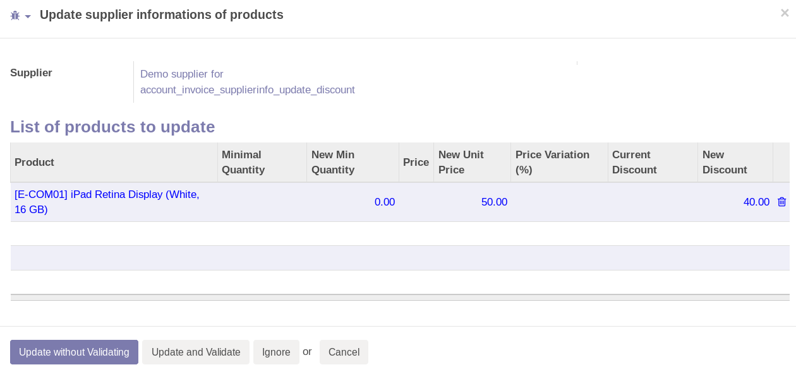

This module is a glue module installed if the following module are installed:
* account_invoice_supplierinfo_update (same repository)
* product_supplierinfo_discount (purchase-workflow repository)

It allows to update discount on supplierinfo, if the invoice line has a
different discount value.

