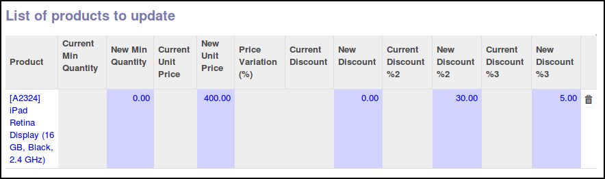

This module is a glue module installed if the following modules are installed:

* ``account_invoice_triple_discount`` (same repository)
* ``account_invoice_supplierinfo_update_discount`` (same repository)
* ``purchase_triple_discount`` (purchase-workflow OCA repository)

It allows to update the three discounts on supplierinfo, if the invoice line
has different discount values.

