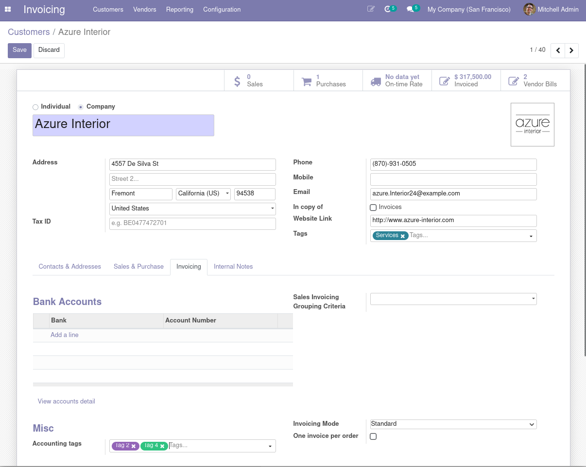
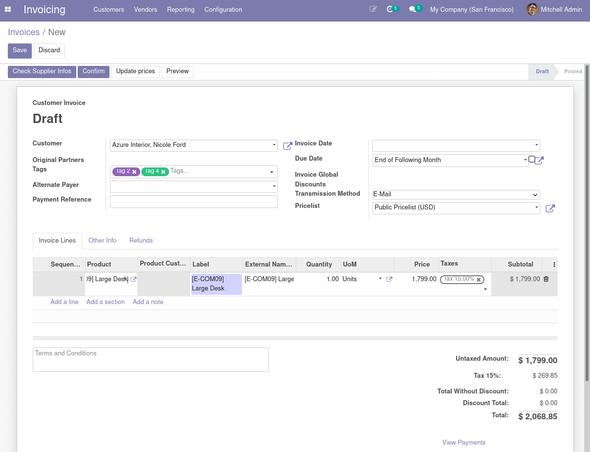
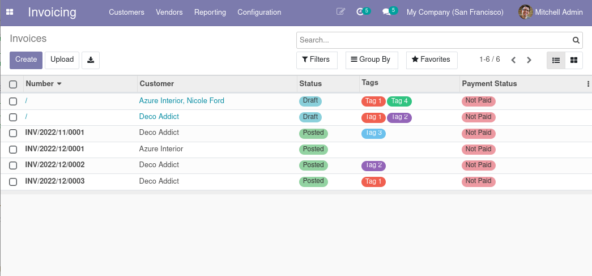
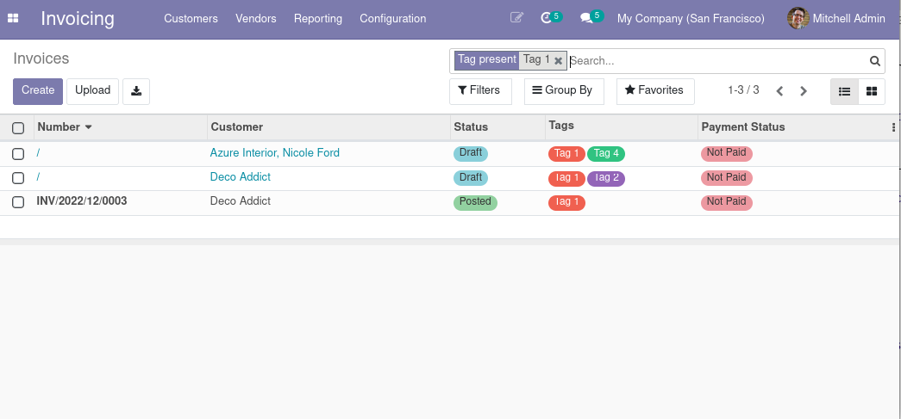
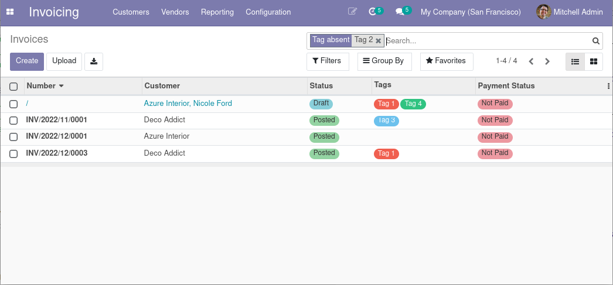
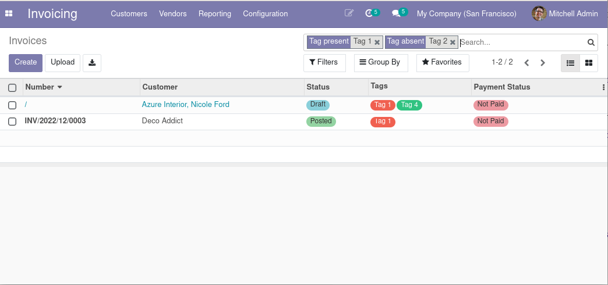

* Accountant user can set default accounting partner category on commercial entity
  (Invoicing > Customers > Customers):

* Those default categories are used while creating new account moves (invoices):

Which you can change for a given invoice.

* Then you use search bar to filter on category (inclusion and/or exclusion).

Data without filters:

Contains `Tag 1`:

Do not contains `Tag 2`:

Contains `Tag 1` but not `Tag 2`:

